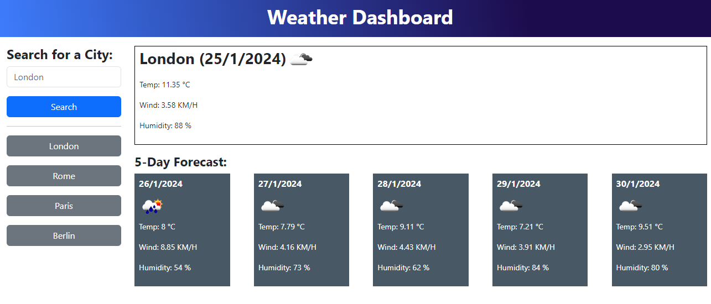

# Server-Side APIs: Weather Dashboard


## 🚩 TABLE OF CONTENT

- [Description](#-description)
- [Usage](#-usage)
- [Installation](#-installation)
- [Credits](#-credits)
- [License](#-license)

## 📖 DESCRIPTION

### 🎯 What is it about?

Server APIs allow developers to access their data and functionality by making requests with specific parameters to a URL. Developers are often tasked with retrieving data from another application's API and using it in their own context. This Challenge has been built for a weather dashboard that will run in the browser and feature dynamically updated HTML and CSS.

### Preview

The following image shows the web application's appearance and functionality:



## 💻 USAGE

[Visit the webpage here](https://astranag.github.io/Weather-Dashboard/)

This app runs advanced JavaScript, integrates third-party APIs, and more. This app will run in the browser and feature dynamically updated HTML and CSS powered by jQuery. It has a responsive, clean, polished user interface that adapts to multiple screen sizes.


## User Story

```text
AS A traveler
I WANT to see the weather outlook for multiple cities
SO THAT I can plan a trip accordingly
```

### ✅ Acceptance Criteria

* Create a weather dashboard with form inputs.
  * When a user searches for a city they are presented with current and future conditions for that city and that city is added to the search history
  * When a user views the current weather conditions for that city they are presented with:
    * The city name
    * The date
    * An icon representation of weather conditions
    * The temperature
    * The humidity
    * The wind speed
  * When a user view future weather conditions for that city they are presented with a 5-day forecast that displays:
    * The date
    * An icon representation of weather conditions
    * The temperature
    * The humidity
  * When a user click on a city in the search history they are again presented with current and future conditions for that city

## 🚀 INSTALLATION

 For users, the project can be easily accessed by following the git clone process toward your local repository.

## 💬 CREDITS

I received guidance from the TAs and instructors in collaboration with this project. The tutorial materials and other resources provided for the enrolled students at the Skills Bootcamp in Front-End Development acted as sources for primary and secondary links for reference. I will be sure to list below more material used towards the challenge. 

Reference List:
* https://www.w3schools.com/
* https://stackoverflow.com/
* https://developer.mozilla.org/en-US/
* https://day.js.org/
* https://api.jquery.com/
* https://openweathermap.org/
* https://cssgradient.io/
  
## 📜 LICENSE

This repository is licensed under the MIT license.
